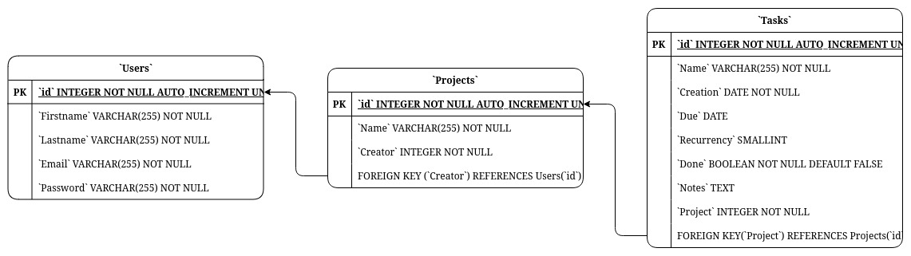

# SAW Project
Clone (fatto male) di todoist

## Struttura iniziale del DB

## Features
Obbligatorie:

- [X] Presentazione di startSAW
- [X] Registrazione di un utente
- [X] Login al sistema
- [ ] Visualizzazione del profilo utente
- [ ] Modifica del profilo utente
- [ ] Motore di ricerca interno
- [X] Logout

A scelta:

- [ ] Newsletter (o notifiche, da vedere)
## Testing
- Uso dell'immagine docker [tomsik68/xampp](https://hub.docker.com/r/tomsik68/xampp/)
```bash
docker compose up -d --build
```
