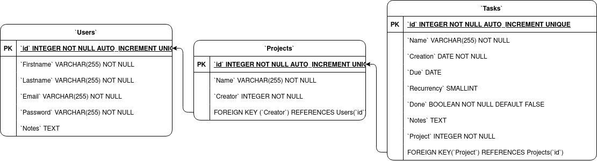

# SAW Project
Clone (fatto male) di todoist

## Struttura iniziale del DB

## Features
Obbligatorie
- Presentazione di startSAW
- Registrazione di un utente
- Login al sistema
- Visualizzazione del profilo utente
- Modifica del profilo utente
- Motore di ricerca interno
- Logout

A scelta
- Newsletter
- Area amministrativa
## Testing
- Uso dell'immagine docker [tomsik68/xampp](https://hub.docker.com/r/tomsik68/xampp/)
```bash
docker compose up -d --build
```
